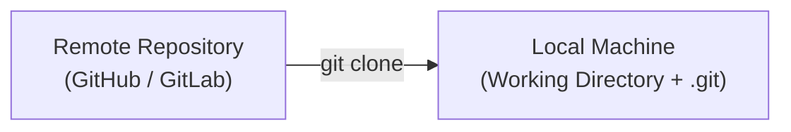
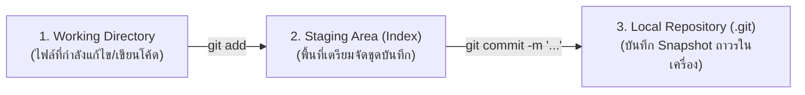
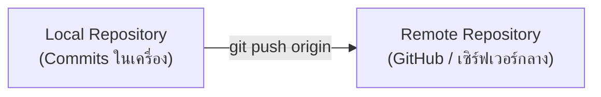
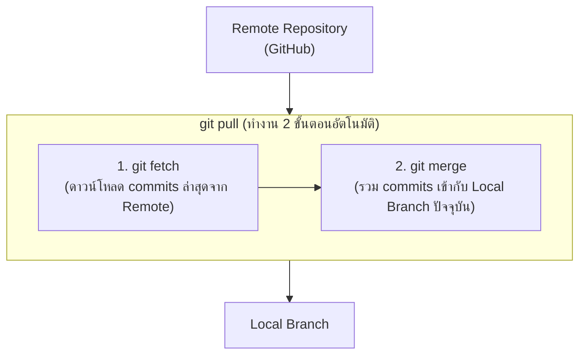
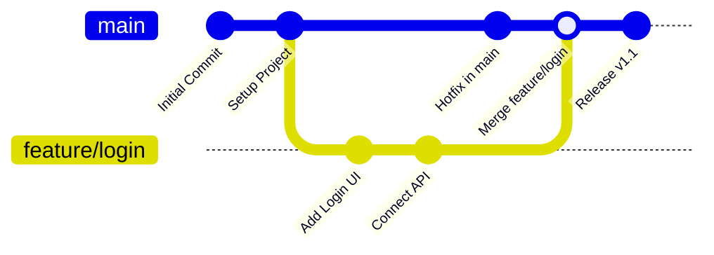

# คู่มือคำสั่ง Git และ GitHub พื้นฐาน (Git & GitHub Essential Guide)

เอกสารนี้รวบรวมคำอธิบายและแนวทางการใช้งานคำสั่งพื้นฐานที่สำคัญของ **Git** (ระบบควบคุมเวอร์ชัน - Distributed Version Control System) และ **GitHub** (บริการคลาวด์สำหรับฝากและแชร์ Git Repository) เพื่อให้เข้าใจหลักการทำงาน จังหวะเวลาที่ควรใช้งาน และตัวอย่างคำสั่งจริงอย่างละเอียด

---

## สารบัญ
1. [`git clone` — การคัดลอก Repository มายังเครื่องคอมพิวเตอร์](#1-git-clone--การคัดลอก-repository-มายังเครื่องคอมพิวเตอร์)
2. [`git add` และ `git commit` — การเตรียมและบันทึกการเปลี่ยนแปลง](#2-git-add-และ-git-commit--การเตรียมและบันทึกการเปลี่ยนแปลง)
3. [`git push` — การส่งการเปลี่ยนแปลงขึ้นสู่ Remote Repository](#3-git-push--การส่งการเปลี่ยนแปลงขึ้นสู่-remote-repository)
4. [`git pull` — การดึงข้อมูลล่าสุดจาก Remote Repository](#4-git-pull--การดึงข้อมูลล่าสุดจาก-remote-repository)
5. [`git branch` / `git switch` / `git checkout` — การจัดการกิ่งงานและการ Merge](#5-git-branch--git-switch--git-checkout--การจัดการกิ่งงานและการ-merge)
6. [สรุปวงจรการทำงานประจำวัน (Daily Git Workflow Summary)](#สรุปวงจรการทำงานประจำวัน-daily-git-workflow-summary)

---

## 1. `git clone` — การคัดลอก Repository มายังเครื่องคอมพิวเตอร์



### 1.1 คืออะไรและใช้สำหรับอะไร
`git clone` คือคำสั่งที่ใช้ในการ**คัดลอก (Clone) โปรเจกต์ทั้งหมด**จาก Remote Repository (เช่น ที่อยู่บน GitHub, GitLab หรือ Bitbucket) มาไว้ที่เครื่องคอมพิวเตอร์ของเรา (Local Machine)

เมื่อใช้คำสั่ง `git clone` สิ่งที่ Git จะดำเนินการให้อัตโนมัติ ได้แก่:
1. ดาวน์โหลดไฟล์ซอร์สโค้ดเวอร์ชันล่าสุด
2. ดาวน์โหลดประวัติการแก้ไขและประวัติ Commit ทั้งหมด (Commit History)
3. สร้างโฟลเดอร์ `.git` ที่เก็บข้อมูล Version Control ให้อัตโนมัติ
4. ตั้งค่า Remote connection ชื่อ `origin` ชี้ไปยัง Repository ต้นทางโดยอัตโนมัติ
5. Checkout กิ่งเริ่มต้น (Default Branch เช่น `main` หรือ `master`) ให้พร้อมเริ่มทำงานทันที

### 1.2 ใช้เมื่อไหร่ / ทำไมถึงสำคัญ
- **เมื่อเริ่มต้นทำงานกับโปรเจกต์ใหม่:** เมื่อได้รับเชิญเข้าร่วมทีม หรือเริ่มพัฒนาโปรเจกต์ที่มีอยู่แล้วบน GitHub
- **เมื่อต้องการศึกษาโค้ด Open-source:** คัดลอกโปรเจกต์ของผู้อื่นมาศึกษาหรือทดสอบบนเครื่องตนเอง
- **ความสำคัญ:** เป็นจุดเริ่มต้น (Entry point) ที่ง่ายและเร็วที่สุดในการสร้าง Local Environment โดยไม่ต้องใช้คำสั่ง `git init` หรือ `git remote add` ด้วยตนเอง

### 1.3 ตัวอย่างการใช้งานจริง

#### ก. การ Clone ผ่านโปรโตคอล HTTPS
```bash
# คัดลอกโปรเจกต์ผ่าน HTTPS URL
git clone https://github.com/username/my-project.git
```

#### ข. การ Clone ผ่านโปรโตคอล SSH (แนะนำเมื่อตั้งค่า SSH Key แล้ว)
```bash
# คัดลอกโปรเจกต์ผ่าน SSH URL
git clone git@github.com:username/my-project.git
```

#### ค. การ Clone และกำหนดชื่อโฟลเดอร์ปลายทางเอง
```bash
# กำหนดให้ดาวน์โหลดมาไว้ในโฟลเดอร์ชื่อ my-custom-app
git clone https://github.com/username/my-project.git my-custom-app
```

#### ง. การ Clone เฉพาะ Branch ที่ต้องการ หรือแบบ Shallow Clone (จำกัดประวัติ)
```bash
# Clone เฉพาะ branch ที่ระบุ
git clone -b develop https://github.com/username/my-project.git

# Clone เฉพาะ commit ล่าสุด 1 ชั้น (ประหยัดเวลาและพื้นที่ สำหรับโปรเจกต์ขนาดใหญ่)
git clone --depth 1 https://github.com/username/my-project.git
```

---

## 2. `git add` และ `git commit` — การเตรียมและบันทึกการเปลี่ยนแปลง



### 2.1 ความหมายและความแตกต่างของทั้งสองคำสั่ง

ในการทำงานของ Git พื้นที่จัดเก็บไฟล์ในเครื่อง Local จะแบ่งออกเป็น 3 ระดับหลัก:
1. **Working Directory (Working Tree):** โฟลเดอร์ที่เราเปิดเขียนโค้ด เพิ่ม ลบ หรือแก้ไขไฟล์
2. **Staging Area (Index):** พื้นที่พักหรือจุดคัดกรองไฟล์ เพื่อจัดเตรียมว่าการเปลี่ยนแปลงใดบ้างที่จะถูกนำไปบันทึกในรอบนี้
3. **Local Repository:** ฐานข้อมูลของ Git ในเครื่อง (`.git`) ที่เก็บประวัติ Snapshot ที่ถูกบันทึกไว้อย่างถาวร

| หัวข้อ | `git add` | `git commit` |
| :--- | :--- | :--- |
| **หน้าที่** | นำไฟล์ที่แก้ไขเข้าสู่ Staging Area | นำไฟล์ใน Staging Area บันทึกลง Local Repository |
| **สถานะไฟล์** | เปลี่ยนจาก *Untracked/Modified* เป็น *Staged* | เปลี่ยนจาก *Staged* เป็น *Committed* |
| **จุดประสงค์** | เลือกว่าจะบันทึกไฟล์ไหนบ้าง (จัดชุดงาน) | สร้างจุด Checkpoint พร้อมข้อความอธิบายประวัติ |
| **ความถี่** | ทำได้เรื่อยๆ ระหว่างเลือกไฟล์ | ทำเมื่อฟังก์ชันการทำงานหรือส่วนงานนั้นเสร็จสมบูรณ์ 1 จุด |

> [!NOTE]
> **ทำไม Git ต้องแยก `git add` ออกจาก `git commit`?**
> เพื่อให้เราสามารถควบคุมและจัดกลุ่มการเปลี่ยนแปลงได้อย่างอิสระ เช่น เราอาจแก้ไขไป 5 ไฟล์ แต่งานที่เสร็จจริงมีแค่ 2 ไฟล์ เราสามารถ `git add` เฉพาะ 2 ไฟล์นั้น เพื่อ commit เป็น 1 หัวข้อ ส่วนอีก 3 ไฟล์ที่เหลือนำไป commit ในหัวข้อถัดไปได้ ทำให้ Commit History สะอาดและตรวจสอบย้อนหลังง่าย

### 2.2 ลำดับการใช้งาน (Workflow Step-by-Step)
1. เขียนหรือแก้ไขโค้ดใน **Working Directory**
2. ตรวจสอบสถานะการเปลี่ยนแปลงด้วย `git status`
3. ใช้ `git add` เพื่อส่งไฟล์ที่ต้องการไปยัง **Staging Area**
4. ตรวจสอบอีกครั้งเพื่อความมั่นใจ
5. ใช้ `git commit -m "ข้อความอธิบาย"` เพื่อบันทึกเป็น Snapshot ใหม่

### 2.3 ตัวอย่างการใช้งานจริง

```bash
# 1. ตรวจสอบสถานะไฟล์ว่ามีไฟล์ใดเปลี่ยนแปลงบ้าง
git status

# 2. นำไฟล์เฉพาะเจาะจงเข้าสู่ Staging Area
git add src/app.service.ts src/app.controller.ts

# หรือ นำไฟล์ทั้งหมดที่มีการเปลี่ยนแปลงเข้าสู่ Staging Area
git add .

# 3. บันทึกการเปลี่ยนแปลง (Commit) พร้อมระบุข้อความอธิบายที่กระชับ ชัดเจน
git commit -m "feat: add user authentication controller and service"

# 4. (ทางลัด) สำหรับไฟล์ที่ถูก Track อยู่แล้ว สามารถ Add และ Commit พร้อมกันได้ด้วยแฟล็ก -am
git commit -am "fix: correct response status code for invalid login"

# 5. ดูประวัติ commit ล่าสุด
git log --oneline -n 5
```

---

## 3. `git push` — การส่งการเปลี่ยนแปลงขึ้นสู่ Remote Repository



### 3.1 คืออะไรและใช้เมื่อไหร่
`git push` คือคำสั่งสำหรับ**อัปโหลดประวัติการ Commit จาก Local Repository บนเครื่องของเรา ขึ้นไปยัง Remote Repository บนเซิร์ฟเวอร์** (เช่น GitHub)

- **ใช้เมื่อไหร่:**
  - เมื่อเราทำ `git commit` ในเครื่องเสร็จสมบูรณ์ และพร้อมที่จะแชร์โค้ดให้สมาชิกในทีม
  - เมื่อต้องการสำรองข้อมูล (Backup) โค้ดเวอร์ชันล่าสุดไว้บนระบบคลาวด์
  - เมื่อต้องการนำโค้ดขึ้น GitHub เพื่อเตรียมเปิด **Pull Request (PR)** ให้ผู้อื่นรีวิว

### 3.2 แตกต่างจาก `git commit` อย่างไร
- `git commit` ทำงานอยู่ **ภายในเครื่อง Local เท่านั้น** แม้ไม่มีอินเทอร์เน็ตก็สามารถ commit ได้ คนอื่นในทีมจะยังมองไม่เห็นโค้ดส่วนนี้
- `git push` เป็นการ **ส่งผ่านข้อมูลผ่านระบบเครือข่าย/อินเทอร์เน็ต** เพื่อทำให้ Remote Repository มีประวัติ Commit ตรงกับเครื่องของเรา เมื่อ push สำเร็จ สมาชิกคนอื่นจึงจะสามารถเห็นและดึงโค้ดไปใช้ได้

| การเปรียบเทียบ | `git commit` | `git push` |
| :--- | :--- | :--- |
| **ตำแหน่งทำงาน** | Local Machine (ออฟไลน์ได้) | ส่งข้อมูลไปยัง Remote Server (ต้องใช้อินเทอร์เน็ต) |
| **ผลลัพธ์** | ได้ Snapshot ใหม่ในเครื่อง | อัปเดต Branch บน GitHub ให้ตรงกับเครื่อง |
| **การมองเห็น** | มีเพียงเราที่เห็น | สมาชิกในทีมทุกคนสามารถเข้าถึงได้ |

### 3.3 ตัวอย่างการใช้งานจริง

```bash
# 1. การ Push ครั้งแรกของ Branch พร้อมตั้งค่า Upstream Tracking (-u)
# ช่วยให้ครั้งต่อไปสามารถพิมพ์แค่ 'git push' ได้เลย
git push -u origin main

# 2. การ Push โค้ดของ Branch ที่ตั้งค่า Upstream ไว้แล้ว
git push

# 3. การ Push กิ่งฟีเจอร์ใหม่ขึ้นไปยัง Remote
git push origin feature/user-profile

# 4. การ Push แท็ก (Tag/Release version)
git push origin v1.0.0
```

> [!WARNING]
> หลีกเลี่ยงการใช้คำสั่ง `git push --force` บน branch หลักที่ทำงานร่วมกัน (เช่น `main`, `develop`) เพราะจะไปเขียนทับประวัติ commit ของผู้อื่น หากจำเป็นต้องใช้ ควรใช้ `git push --force-with-lease` ซึ่งมีความปลอดภัยมากกว่า

---

## 4. `git pull` — การดึงข้อมูลล่าสุดจาก Remote Repository



### 4.1 คืออะไรและใช้เมื่อไหร่
`git pull` คือคำสั่งสำหรับ**ดาวน์โหลดการเปลี่ยนแปลงล่าสุดจาก Remote Repository และนำมารวม (Merge) เข้ากับ Branch ปัจจุบันในเครื่องของเราโดยอัตโนมัติ**

เบื้องหลังการทำงานของ `git pull` คือการรวบสองคำสั่งเข้าด้วยกัน:
$$\text{git pull} = \text{git fetch} + \text{git merge}$$

- **ใช้เมื่อไหร่:**
  - **ก่อนเริ่มทำงานในแต่ละวัน:** เพื่ออัปเดตโค้ดในเครื่องให้เป็นเวอร์ชันล่าสุดเสมอ
  - **ก่อนสร้าง Branch ใหม่:** เพื่อให้ Branch ใหม่แตกออกมาจากโค้ดล่าสุด
  - **ก่อนที่จะทำ `git push`:** เพื่อตรวจดูว่ามีเพื่อนร่วมทีม push โค้ดใหม่ขึ้นไปตัดหน้าหรือไม่

### 4.2 ความสำคัญต่อการทำงานร่วมกันเป็นทีม
1. **ป้องกันปัญหา Merge Conflict ขนาดใหญ่:** หากดึงโค้ดล่าสุดมาผสานอย่างสม่ำเสมอ จะช่วยลดโอกาสที่โค้ดจะขัดแย้งกันอย่างรุนแรง
2. **ป้องกันการพัฒนาบนฐานโค้ดที่ล้าสมัย (Stale Code):** ทำให้มั่นใจว่าเรากำลังเขียนฟังก์ชันต่อยอดจากโค้ดล่าสุดของเพื่อนในทีม ไม่ทำงานซ้ำซ้อน
3. **ช่วยให้การผสานโค้ดราบรื่น:** ตรวจพบและแก้ไขข้อขัดแย้งของโค้ดตั้งแต่เนิ่นๆ ในเครื่องของตนเอง ก่อนส่งขึ้นระบบหลัก

### 4.3 ตัวอย่างการใช้งานจริง

```bash
# 1. ดึงข้อมูลและรวมโค้ดของ Branch ปัจจุบัน (ที่ตั้ง Upstream ไว้แล้ว)
git pull

# 2. ระบุ Remote และ Branch อย่างชัดเจน
git pull origin main

# 3. ดึงโค้ดโดยใช้ Rebase (แนะนำ: ช่วยให้ประวัติ Commit เป็นเส้นตรง ไม่เกิด Merge commit รก)
git pull --rebase origin main
```

#### ข้อแนะนำเมื่อพบข้อขัดแย้ง (Merge Conflict):
เมื่อมีข้อขัดแย้ง Git จะแจ้งเตือนไฟล์ที่มีปัญหา:
1. เปิดไฟล์ที่มี conflict ขึ้นมาแก้ไข (เลือกรับโค้ดส่วนของเรา ของเพื่อน หรือทั้งคู่)
2. เมื่อแก้ไขเสร็จแล้ว ให้พิมพ์:
```bash
git add <ชื่อไฟล์ที่แก้ conflict แล้ว>
git commit -m "fix: resolve merge conflict with origin/main"
```

---

## 5. `git branch` / `git switch` / `git checkout` — การจัดการกิ่งงานและการ Merge



### 5.1 ความหมายของ Branch
**Branch (กิ่งงาน)** คือเส้นทางการพัฒนาที่แยกตัวออกมาจากโค้ดหลัก เพื่อให้เราสามารถ:
- พัฒนาฟีเจอร์ใหม่ (New Feature)
- ทดลองแนวคิดใหม่ (Experiment)
- แก้ไขข้อผิดพลาดเฉพาะจุด (Bug Fix / Hotfix)

โดย**ไม่กระทบต่อโค้ดหลัก (`main`) ที่กำลังทำงานอยู่บน Production** จนกว่างานบน Branch นั้นจะเสร็จสมบูรณ์และผ่านการทดสอบเรียบร้อยแล้ว จึงค่อยนำมารวม (Merge) กลับเข้าสู่โค้ดหลัก

### 5.2 ความแตกต่างระหว่าง `git checkout` และ `git switch`
ใน Git เวอร์ชัน 2.23 เป็นต้นไป ได้มีการเพิ่มคำสั่ง `git switch` เพื่อแยกหน้าที่ให้ชัดเจน:
- **`git checkout`:** เป็นคำสั่งดั้งเดิมที่มีหลายหน้าที่มาก (ทั้งสลับ Branch, กู้คืนไฟล์, ย้อนดู commit ในอดีต) ทำให้ผู้เริ่มต้นสับสนได้ง่าย
- **`git switch`:** ออกแบบมาสำหรับ **การสลับและสร้าง Branch โดยเฉพาะ** (แนะนำให้ใช้งานเป็นมาตรฐานใหม่)
- **`git restore`:** ออกแบบมาสำหรับ **การยกเลิกการแก้ไขไฟล์หรือกู้คืนไฟล์** แทนหน้าที่เดิมของ `git checkout`

### 5.3 คำสั่งและขั้นตอนการทำงานครบวงจร (Branch Lifecycle)

#### ขั้นตอนที่ 1: ตรวจสอบและสร้าง Branch ใหม่
```bash
# ดูรายชื่อ Branch ทั้งหมดในเครื่อง (* คือ branch ที่กำลังอยู่)
git branch

# สร้าง Branch ใหม่ชื่อ feature/auth (แต่ยังไม่อพยพไป)
git branch feature/auth

# สลับไปยัง Branch ที่ต้องการ
git switch feature/auth
# (หรือคำสั่งเดิม: git checkout feature/auth)

# [ทางลัดที่นิยมใช้] สร้าง Branch ใหม่และสลับไปใช้งานทันทีในคำสั่งเดียว
git switch -c feature/auth
# (หรือคำสั่งเดิม: git checkout -b feature/auth)
```

#### ขั้นตอนที่ 2: ทำงาน พัฒนาโค้ด และบันทึกบน Branch ของตนเอง
```bash
# เขียนโค้ดตามปกติ...
git add .
git commit -m "feat: implement JWT token authentication"

# Push Branch นี้ขึ้น GitHub เพื่อสำรองข้อมูลหรือเปิด Pull Request
git push -u origin feature/auth
```

#### ขั้นตอนที่ 3: สลับกลับมายัง Branch หลัก และดึงข้อมูลล่าสุด
```bash
# สลับกลับมาที่กิ่งหลัก main
git switch main

# ดึงโค้ดล่าสุดของ main เผื่อมีเพื่อนอัปเดต
git pull origin main
```

#### ขั้นตอนที่ 4: รวม Branch (Merge) กลับเข้าสู่กิ่งหลัก
```bash
# รวมโค้ดจาก feature/auth เข้าสู่ main (ปัจจุบันเราต้องอยู่ที่ main)
git merge feature/auth
```

#### ขั้นตอนที่ 5: ลบ Branch ที่ใช้งานเสร็จสิ้นแล้ว
```bash
# ลบ Local branch ที่ merge เรียบร้อยแล้ว
git branch -d feature/auth

# (กรณีต้องการลบ Remote branch บน GitHub)
git push origin --delete feature/auth
```

---

## สรุปวงจรการทำงานประจำวัน (Daily Git Workflow Summary)

เพื่อให้เห็นภาพรวม ต่อไปนี้คือลำดับคำสั่งที่โปรแกรมเมอร์นิยมใช้ในการทำงานจริงประจำวัน:

```bash
# 1. เริ่มต้นวัน: สลับไปที่ main และดึงโค้ดล่าสุด
git switch main
git pull origin main

# 2. แตกกิ่งใหม่เพื่อเริ่มฟังก์ชันใหม่
git switch -c feature/shopping-cart

# 3. แก้ไขโค้ด ทดสอบจนมั่นใจ แล้วจัดเตรียม/บันทึก Commit
git status
git add .
git commit -m "feat: add calculate total price method"

# 4. ส่งกิ่งงานขึ้น GitHub เพื่อให้ทีมรีวิว
git push -u origin feature/shopping-cart

# 5. เมื่อรีวิวและ Merge ผ่าน Pull Request บน GitHub เสร็จแล้ว
git switch main
git pull origin main
git branch -d feature/shopping-cart
```

---
*เอกสารจัดทำขึ้นเพื่อให้ความรู้และเป็นแนวทางมาตรฐานในการทำงานร่วมกันด้วย Git & GitHub*
